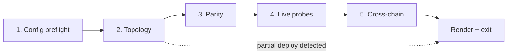

# Specflow analysis — deployment smoke tests

Spec under review: `specs/deployment-smoke-tests/interview-notes.md`.
Grounded against the `enh/scripts` branch (PR 309 tip). Code references are absolute.

## 1. Missing flows / edge cases

### Must-fix (block v1 implementation)

**M1. Partial-deploy resume state.** PR 309 introduces idempotent skip paths in `script/base/BaseChainDeployment.sol`; a deploy can legitimately exit with a subset of contracts deployed and the rest pending. The interview notes never define smoke's contract with that state. The harness must answer up front: either (a) refuse to run when any expected address has no code and tell the operator to finish the deploy, or (b) run only the checks reachable from deployed addresses and report `<deployed>/<expected> contracts present, parity for deployed subset only`. The behaviour also drives the exit code on partial state — same as a failure, or a distinct `incomplete` status. Defer the answer and the renderer plus exit-code policy both have to be retrofitted.

**M2. Bytecode mismatch on the skip path.** `BaseChainDeployment.sol:624` (`_assertDeployedMatchesReference`) defends the deploy script when a contract already exists at the predicted CREATE3 address but the runtime code does not match what the current source tree would produce (stale prior deploy, same-salt collision, different constructor args). Smoke is the only artefact that runs *after* deploy is done, with full read access. It should re-derive `keccak256(actual.code)` from the artefact and compare against `keccak256(forge inspect <C> deployedBytecode)`. The interview notes name "CREATE3 + artefact + live code" as the three sources of truth but never specify the bytecode-hash equality check. Without it, smoke happily certifies a deployment whose contracts have the *right address* but the *wrong code*.

**M3. Cross-reference immutables are `internal`, no public getters.** `StableVault.sol:115-127`, `Allocator.sol:62-67`, and `FundsHandler.sol:46-49` all hold their cross-refs as `internal immutable`. The interview notes promise "immutable cross-refs (StableVault.ASSET_REGISTRY etc.) point at deployed addresses" but the only way to read them today is bytecode disassembly or storage-slot inspection. Pick one and commit it in v1:
- (a) Add public getters in a sibling PR (e.g. `getAssetRegistry()`, `getPriceOracle()`, `getPolicyRegistry()` across the three contracts). Per the global CLAUDE.md rule on minimal API surface, surface the exact diff before adding.
- (b) Drop the immutable cross-ref check from v1 and rely solely on CREATE3 re-derivation as proof of wiring. Document that "if `StableVault` at the predicted CREATE3 address is correctly bytecode-equivalent to the source, its `ASSET_REGISTRY` *must* equal the predicted `AssetRegistry` address because the constructor receives it" — i.e. bytecode equivalence is a transitive proof.
- (c) Leave a TODO and ship v1 without the check, deferring to v1.1.

The interview notes implicitly assume (a) without saying so. Recommend (b) as the literal/minimal reading — bytecode-equivalent contract + correct constructor args (assertable from broadcast logs) = cross-ref correctness. Cheapest path; no new API surface.

**M4. Per-chain oracle adapter naming divergence.** The earning artefact ships `ChainlinkPriceOracleAdapter::GHO/USDC/USDT` and has no `ChainBalanceOracle` at all; the accounting artefact ships `ChainlinkL2PriceOracleAdapter::*` plus `ChainlinkL2ChainBalanceOracleAdapter`. The catalogue must key on the right adapter contract per chain, and the bytecode-equivalence check has to compare against the right reference (`ChainlinkPriceOracleAdapter` for EC, `ChainlinkL2PriceOracleAdapter` for AC). If the catalogue is monolithic, this is a silent mismatch source.

**M5. Conditional a.DI adapter.** `BaseChainDeployment.sol:228` gates `AdiAdapter` deployment on `adi.crossChainController != address(0)`. The preprod artefacts have no `AdiAdapter` entry at all (a.DI controller is set in config but the adapter is *registered* via `registerOnGateway` separately, see `BaseChainDeployment.sol:303-313`). Prod config has `crossChainController: "0x0000…0000"` plus `registerOnGateway: false`, so prod won't have an `AdiAdapter` entry either when first deployed. Smoke must:
- Detect the artefact's `AdiAdapter` presence, not assume it.
- When present and `registerOnGateway: true`, verify the bridge-adapter whitelist on `BaseChainGateway.isBridgeAdapterSupported(ASSET_FOR_DATA_ONLY_BRIDGE, remoteChainId, adiAdapter)` returns true.
- When `registerOnGateway: false` *and* adapter is deployed, the whitelist must return false. Verify the negative.
- When the artefact has no `AdiAdapter`, all a.DI checks skip with a status of `n/a` (not pass, not fail).

The interview notes say "a.DI registerOnGateway flag matches config" but don't enumerate the three-state shape (absent / deployed-not-registered / deployed-and-registered).

**M6. Cross-chain consistency invariants.** Values that *must* match between AC and EC:
- `iouTokenName`, `iouTokenSymbol` (top-level, not chain-scoped)
- `priceOracleMinValidPriceRay` (top-level)
- `lowDelay`, `mediumDelay`, `highDelay`, `criticalDelay`, `maxStrategiesPerAsset` (top-level)
- `profiles.*` (must match across chains)
- AC's `accountingChain.chainId` must equal EC's expected counterparty
- The CCIP `ccipSelector` of each side must be the *peer's* selector for the cross-chain message routing

The interview notes scope smoke to "per-chain" without naming these. A single `--chain` run cannot validate cross-chain invariants; smoke must offer either:
- a `--check-cross-chain` mode that loads both artefacts + both RPCs and runs the invariants, or
- a per-chain mode that re-reads the *other* chain's `deployments/<env>/<v>/<chain>.json` artefact (no RPC needed for static config) and compares the JSONC-derived values against the local on-chain state.

**M7. Stale artefact / hand-edited artefact.** `deployments/<env>/<v>/<chain>.json` is committed to git, which means it can drift from on-chain state through (a) a manual edit, (b) someone running a deploy script from a stale branch, (c) a rebase that drops a deploy commit. Smoke's existing "CREATE3 + artefact + live code" triangulation does catch this, but only if all three are checked simultaneously *and* the divergence reported is actionable. The interview notes don't specify *which* of the three sources is "ground truth" when they disagree:
- Artefact says `0xAAA…`, CREATE3 derivation says `0xBBB…`, on-chain `0xBBB…` has code → artefact is stale.
- Artefact says `0xAAA…`, CREATE3 derivation says `0xAAA…`, on-chain `0xAAA…` has no code → deploy never completed.
- Artefact says `0xAAA…`, CREATE3 derivation says `0xAAA…`, on-chain `0xAAA…` has code but wrong bytecode → collision or stale prior deploy.

Recommendation: CREATE3 derivation is the canonical source. Artefact mismatch fails with a specific `artefact-stale` error code so CI can suggest "regenerate `deployments/...`".

### Should-fix (significantly degrades v1 if missed)

**S1. TBD / zero-address placeholders.** Prod config (`config/deployment-config.prod.jsonc`) currently has six `// TODO: set` placeholders: `coverageGuardian`, two `crossChainController`s, `chainlinkBundleAggregatorProxy`, plus per-chain `capacityRay`/`refillRateRay`/`minRedemptionCapacityRay`/`minRedemptionRefillRateRay` strings `"TBD"`. Smoke should:
- In `--json` mode, always list these as warnings even on a pass run, with the exact JSONC path.
- In default mode, render a banner at the top: "config has N unresolved placeholders" before the pass/fail tally.
- Decide the policy: TBD in the JSONC = automatic warning, never a failure (since deploy hasn't happened for those values). Zero address read from the chain when the config is non-zero = failure.

**S2. Per-asset assets that don't exist on the chain yet.** The catalogue is keyed on `AssetKey = "gho" | "usdc" | "usdt"` but a v1 deploy may register only `gho`, deferring `usdc`/`usdt`. The catalogue's `perAsset` expansion (`tools/roles/lib/parameters.ts`) iterates all assets blindly. Smoke must:
- Read the actual registered asset list via `AssetRegistry.getRegisteredAssets()` (live) and intersect with the catalogue's `AssetKey[]`.
- Any asset configured in JSONC but not registered on-chain → fail with "asset configured but not registered".
- Any asset registered on-chain but not in JSONC → fail with "asset registered but not in config".
- Per-asset getters for non-registered assets skip silently.

**S3. ChainBalanceOracle staleness during the smoke run.** `ChainlinkChainBalanceOracleAdapter.sol:28` adds a buffer to the heartbeat for "publishing delays during network congestion". If the feed is fresh at smoke start and stale by the time the check runs (2-minute parity sweep), the result is non-deterministic. Two fixes:
- Pin every read to `blockNumber: <start>` via viem's multicall — the entire smoke run becomes a single block snapshot. `getStorageAt` is per-block by default but multicall accepts `blockNumber`. This is the canonical fix and is what the best-practices research recommends.
- For the live-probe stage, accept staleness as `warn` not `fail` when `now - lastUpdateTimestamp` is within `heartbeat + buffer` (matches contract logic) but record the age.

**S4. RPC 429 / rate-limit mid-run.** Alchemy guidance (best-practices.md §4) caps reliable batches under 50 calls. The interview notes mention "~150 reads" but no retry/backoff policy. Smoke must:
- Use viem's `http(url, { retryCount: 3, retryDelay: 150 })` per framework-docs §1.1.
- Chunk multicalls to ≤50 contracts per call.
- On unrecoverable 429, exit with a distinct code (`rpc-rate-limit`) so CI can re-run rather than treat it as a parity failure.

**S5. `useMockBundleFeed` / `useMockSequencerUptimeFeed` are staging-only.** `config/deployment-config.staging.jsonc` has both true; preprod and prod have both false. Smoke must read the on-chain `chainlinkBundleAggregatorProxy` and compare against config; if `useMockBundleFeed` is true, the address being checked is the mock, not Chainlink's live feed. Either the catalogue branches on these flags, or smoke materialises the *effective* feed address before comparison. Without this, staging smoke either compares against the wrong address (mock vs live) or skips the check entirely.

**S6. Multiple bridge adapters per (asset, chain).** `BaseChainGateway.isBridgeAdapterSupported(asset, chainId, adapter)` is keyed on a triple. Both CCIP and a.DI can be registered for the same (asset, chain), and the config implicitly allows more in future. Smoke should enumerate all known adapters from the artefact (`CcipAdapter`, `AdiAdapter`) and check each `(asset, chainId, adapter)` triple — not assume CCIP is the only money-bearing adapter or a.DI is the only data-only one. The interview notes mention both adapters but don't specify enumeration.

### Nice-to-have

**N1. Commit SHA + JSONC SHA + artefact SHA in the JSON report.** For audit trail. The JSON report should include `{ smokeSha, configSha, artefactSha, blockNumber, ranAt, env, chain }`. The mockup banner has commit SHA but the JSON schema is not specified.

**N2. Diff mode.** "smoke now vs smoke last week" — out of scope for v1 per the interview notes ("Multi-deploy diff … Deferred") but worth pinning the JSON schema so v1 reports are diffable later. Specifically: keys must be deterministic (sorted), values must be normalised to strings (no `bigint` JSON serialisation surprises), and the schema version field must exist from day one.

**N3. JSON `--json` mode warnings.** Should always include `warnings: []` even on pass — operators piping to `jq` rely on stable shape. The interview notes mention `--json` as an output mode but don't fix the schema.

**N4. SourceChainTimestamp vs lastUpdateTimestamp on `ChainBalanceOracle`.** The struct returns five fields (`balanceRay, lastUpdateTimestamp, sourceChainTimestamp, sourceChainBlockNumber, isStale`). The interview output mockup only shows `isStale=false  age=42s  lastBlock=23456789`. Worth pinning whether `age` is `now - lastUpdateTimestamp` (local oracle write age) or `now - sourceChainTimestamp` (source-chain freshness). They diverge under bridging latency.

**N5. ATokenVaults array.** The artefact's `aTokenVaults` is an *array*, not an `Implementation` map. The catalogue keying must handle array iteration. Today `tools/roles/lib/parameters-spec.ts` doesn't have a precedent for arrays of contracts; the catalogue extension needs an `arrayPerEntry` value-spec type or the smoke side has to special-case ATokenVaults.

## 2. Refined acceptance criteria

The interview's "What lives in scope for v1" table is missing:

- **Bytecode equivalence (per M2).** Add a column "bytecode hash" — `keccak256(actual.code) == keccak256(forge inspect <C> deployedBytecode)` for every CREATE3-derived address. For transparent proxies, check both proxy bytecode and impl bytecode.
- **ATokenVaults iteration.** Per-vault check that the on-chain asset symbol matches the artefact entry, plus the proxy points at the expected ATokenVault implementation.
- **PolicyRegistry coverage.** The catalogue doesn't currently mention `PolicyRegistry.getPolicy(BRIDGE_POLICY_ID)` / `getPolicy(REBALANCE_POLICY_ID)`. Add it — the indirection through PolicyRegistry is exactly where wiring bugs hide.
- **Cross-chain invariants (per M6).** Add a `Cross-chain` check group separate from `Topology` and `Access control`.
- **Deployer's `ADMIN_ROLE` revoked.** Already listed under AccessManager but worth being explicit: this is a *post-deploy* invariant; if it fails, the deploy is unsafe to use.
- **TBD-placeholder scan (per S1).** Add a `Config preflight` check group: warns on TBD strings and zero-address fields without on-chain checking.

### Parity engine unit test

The simplest test for `parity.ts` is a table-driven test with a mock viem client:

```ts
const mockClient = { readContract: async ({functionName}) => MOCK_RETURNS[functionName] };
const spec = { key: 'maxValidPerSecondRate', getter: 'getMaxValidPerSecondRate', expected: 1000n, format: 'rayPerSec' };
expect(await checkParity(mockClient, spec)).toEqual({ status: 'pass', actual: 1000n, expected: 1000n });
```

Then cases for: bigint coercion from JSON-string vs JSON-number config sources, mismatch (status='fail'), reverted call (status='error'), per-asset expansion, missing asset.

## 3. Open questions for the technical spec

Ordered by priority. Default assumption in italics.

1. **Cross-reference immutables: ship public getters in v1 or accept transitive bytecode proof?** Recommendation: accept the bytecode-equivalence transitive proof. *Default if unanswered: rely on bytecode equivalence + constructor-args proof; do not block on adding accessors.*
2. **Partial-deploy behaviour: hard-stop or graceful subset report?** Recommendation: graceful subset, exit code 2 (distinct from parity-fail exit 1). *Default: hard-stop with exit 1.*
3. **Cross-chain mode in v1 or v2?** If v1, the catalogue type system must already model `chainContext: AC+EC` invariants. *Default: v1 ships per-chain, cross-chain consistency check deferred to v1.1.*
4. **TBD placeholder policy.** Warn or fail when JSONC contains `"TBD"` or zero address? Recommendation: warn (deploy hasn't filled them yet). *Default: warn, never fail; surface count in banner.*
5. **Block pinning across the run.** Every read pinned to the same `blockNumber`? Recommendation: yes — captured at run start, threaded through all `multicall`s. *Default: pin block.*
6. **Live-probe staleness handling.** ChainBalanceOracle reads `isStale=true` mid-run — fail or warn? Recommendation: pin block, eliminate the race entirely. If it still reports stale at that pinned block, that's a fail. *Default: fail on isStale=true.*
7. **Exit code policy.** Single binary (0=pass, 1=any fail)? Or tiered (0=pass, 1=parity-fail, 2=incomplete-deploy, 3=rpc-error)? Recommendation: tiered. *Default: binary 0/1 with `--allow-warnings`.*
8. **`--allow-warnings` semantics.** Does it suppress *exit code* or *output*? Recommendation: suppresses exit code only (warnings still printed). *Default: suppresses exit code.*
9. **First-error fail-fast vs aggregate-all?** Recommendation: aggregate-all by default, `--fail-fast` for CI signal. *Default: aggregate-all.*
10. **JSON schema version field.** Pin from v1 so downstream diff tools have a stable shape. *Default: `"schemaVersion": "1"`.*
11. **ATokenVault iteration shape in catalogue.** New `arrayPerEntry` ValueSpec or special-case? *Default: special-case in v1, generalise in v2.*
12. **Effective-feed resolution for staging.** Catalogue branches on `useMockBundleFeed` or smoke resolves before comparison? *Default: smoke resolves; catalogue stays flat.*

## 4. Recommended order of operations

Sequential phases with clear gates. Each phase aggregates results; failure in an early phase short-circuits later ones only where the later phase is meaningless without the earlier.



1. **Config preflight (instant, no RPC).** Load JSONC, scan for `TBD`/zero-address placeholders, validate schema. Capture `configSha`, `artefactSha`, `smokeSha`, `blockNumber`. Emits warnings only.
2. **Topology.** Per artefact entry: CREATE3 re-derivation, `code.length > 0`, ERC-1967 slots (transparent proxies), bytecode-hash equivalence (M2). If >N contracts are missing code → flag as `partial deploy`, skip parity for those contracts but continue. Pinned to the snapshot block.
3. **Parity.** Catalogue-driven multicall. Skip per-asset entries for assets not registered (S2). Skip checks whose target contract failed topology. All multicalls pinned to the snapshot block.
4. **Live probes.** `PriceOracle.getPrice` per asset, `ChainBalanceOracle.getChainBalance(peerChainId)`, `CCIPRouter.isChainSupported(peerChainSelector)`, sequencer uptime feed status. Pinned where possible; some external feeds may not respect block-pin.
5. **Cross-chain (optional, `--check-cross-chain`).** Load peer chain's artefact + config, assert invariants from M6.
6. **Render + exit.** Aggregate all results, write JSON to `tools/smoke/output/<env>-<chain>-<ISO>.json`, render console table.

Rationale:
- Config preflight is free and fails fast on the cheapest class of errors.
- Topology before parity because parity for not-deployed contracts is undefined.
- Live probes last because they're slowest (each is a real RPC roundtrip, no batching) and least useful as a gate (an oracle being stale is operationally interesting but doesn't mean the deploy is wrong).
- Cross-chain optional because it requires a second RPC config.
- Aggregate-all by default; `--fail-fast` available for CI where a single failure means abort.

## 5. Exit-code and failure-mode policy

Tiered exit codes (extends the binary default):

| Code | Meaning | Trigger |
|---|---|---|
| 0 | All checks pass | No failures, no warnings (or `--allow-warnings` set) |
| 1 | Parity failure | At least one check returned `fail` |
| 2 | Incomplete deploy | At least one expected contract has no on-chain code; remaining checks ran on the deployed subset |
| 3 | RPC error | Multicall returned 429, or transport-level failure exhausted retries |
| 4 | Config error | JSONC parse error, schema mismatch, artefact missing |

Flags:
- `--allow-warnings`: TBD placeholders + non-fatal warnings still print but don't affect exit (still exits 0).
- `--fail-fast`: stop at first failure rather than aggregate.
- `--json`: machine-readable; suppresses console table.
- `--summary`: opt-in compact view.
- `--quiet`: failures only.
- `--check-cross-chain`: enables phase 5.

The interview notes' "143 checks · 143 passed · 0 failed" footer is preserved. JSON report mirrors the exit-code field plus per-check status enum (`pass | fail | skip | warn | error | n/a`).

## 6. Snapshot — what to commit before implementation

- Decision on M3 (immutables): bytecode-equivalence transitive proof, or add public getters.
- Decision on cross-chain mode (M6): v1 or v1.1.
- JSON report schema v1 (closes N1, N3, N4, partly answers Q10).
- Exit-code table above.
- Catalogue extension shape — `getter` field on `ParameterSpec` vs sibling `GETTER_SPECS` keyed on the same `key`.
- Catalogue handling for ATokenVaults array (N5).
- Catalogue handling for conditional contracts (M5: `AdiAdapter`).

## Relevant file paths

- `/Users/timepunk/work/stable-vault/specs/deployment-smoke-tests/interview-notes.md`
- `/Users/timepunk/work/stable-vault/specs/deployment-smoke-tests/research/repo-analysis.md`
- `/Users/timepunk/work/stable-vault/specs/deployment-smoke-tests/research/best-practices.md`
- `/Users/timepunk/work/stable-vault/specs/deployment-smoke-tests/research/framework-docs.md`
- `/Users/timepunk/work/stable-vault/script/base/BaseChainDeployment.sol` (skip mechanism, `_assertDeployedMatchesReference`, `_isAdiAdapterDeployed`)
- `/Users/timepunk/work/stable-vault/script/base/AccountingChainDeployment.sol` (AC-specific deployment branches)
- `/Users/timepunk/work/stable-vault/script/base/EarningChainDeployment.sol` (EC-specific deployment branches)
- `/Users/timepunk/work/stable-vault/script/base/Create3AddressBook.sol` (salt seeds)
- `/Users/timepunk/work/stable-vault/script/libraries/Create3AddressLib.sol` (CREATE3 algorithm to port to viem)
- `/Users/timepunk/work/stable-vault/src/core/StableVault.sol` (internal immutables, M3)
- `/Users/timepunk/work/stable-vault/src/core/Allocator.sol` (internal immutables, M3)
- `/Users/timepunk/work/stable-vault/src/core/accounting/FundsHandler.sol` (internal immutables, M3)
- `/Users/timepunk/work/stable-vault/src/core/BaseChainGateway.sol` (`isBridgeAdapterSupported`, M5)
- `/Users/timepunk/work/stable-vault/src/oracles/balance/ChainlinkL2ChainBalanceOracleAdapter.sol` (M4, S3)
- `/Users/timepunk/work/stable-vault/src/oracles/balance/ChainlinkChainBalanceOracleAdapter.sol` (S3)
- `/Users/timepunk/work/stable-vault/config/deployment-config.preprod.jsonc`
- `/Users/timepunk/work/stable-vault/config/deployment-config.prod.jsonc` (TBD placeholders, S1)
- `/Users/timepunk/work/stable-vault/config/deployment-config.staging.jsonc` (mock-feed flags, S5)
- `/Users/timepunk/work/stable-vault/deployments/preprod/v1/accounting.json`
- `/Users/timepunk/work/stable-vault/deployments/preprod/v1/earning.json`
- `/Users/timepunk/work/stable-vault/tools/roles/lib/parameters-spec.ts` (catalogue to extend)
- `/Users/timepunk/work/stable-vault/tools/roles/lib/parameters.ts` (formatting reuse)
- `/Users/timepunk/work/stable-vault/tools/roles/lib/load-signatures.ts` (selector lookup reuse)
